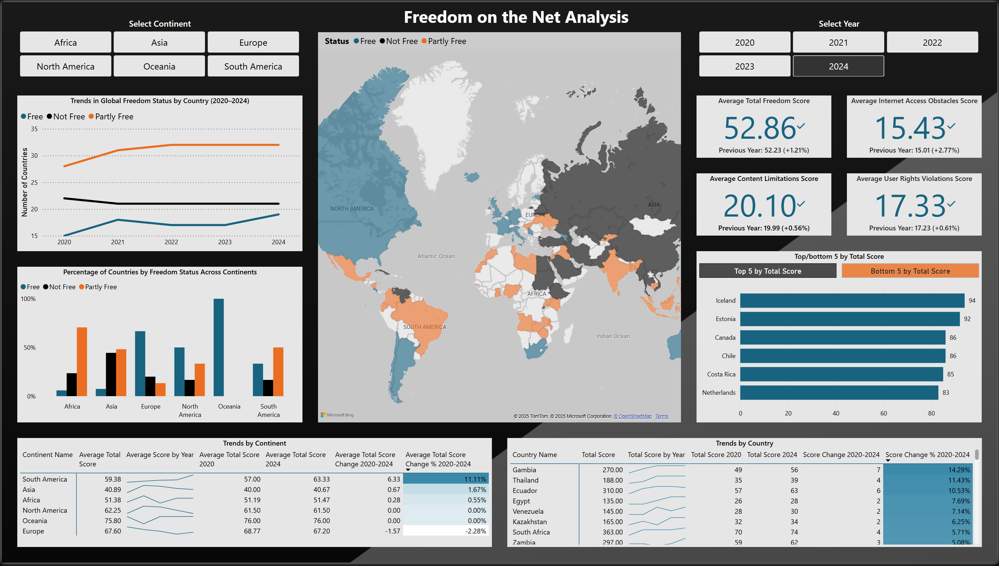

Data downloaded from: https://freedomhouse.org/report/freedom-net
 
# AdventureWorks Sales Dashboards

📂 Project Structure

- **data/**  
  Data in CSV format 
- **FreedomOfTheNetAnalysis.pbix**  
  The Power BI Desktop file containing all visuals, measures, and data model.  
- **Images/**  
  Image assets used in the dashboard and README.  
- **FreedomOfTheNet.pdf**  
  A printable guide with screenshots of each report page.  

---

## 🖼 Dashboard

---

## 📊 Project Overview

With this personal project, I set out to analyze a subject that genuinely interests me - global internet freedom. Extract meaningful, actionable insights. Below are the key trends and observations uncovered through this analysis:

### Key Insights & Trends

- **Overall Freedom Is Improving Gradually**  
  The average Total Freedom Score increased by approximately **+0.3 points per year** from 2020 to 2024, indicating a steady, positive trajectory.

- **Projected Outlook (2025–2027)**  
  Analyzing these linear trends suggests modest further gains in overall freedom and user rights.

- **Widening Freedom Divide**  
  High-scoring democracies continue pulling ahead while many authoritarian regimes (notably: China/Myanmar, and parts of Eurasia) tighten online controls.

- **Strategic Market Opportunities**  
  Alternative connectivity (satellite/mesh),  privacy-first platforms can thrive by addressing region-specific barriers and emerging openings.

---

## 🧗‍♂️ Challenges & Lessons Learned

- **Data Modeling:**  
  Building lookup tables and merging diverse sources to ensure a consistent, accurate dataset.

- **Contextual Research:**  
  Investigating external factors—policy shifts, infrastructure changes—that influence the raw metrics.

- **Insight Communication:**  
  Moving beyond chart-driven reports to narrative-rich storytelling by adding clear written takeaways alongside visualizations, improving stakeholder understanding and engagement.

