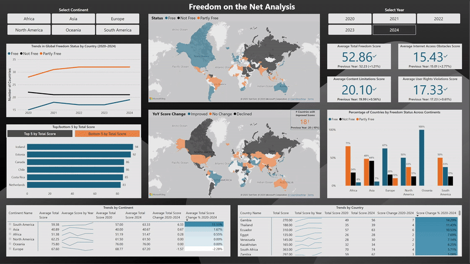

Data Source: [Freedom House – Freedom on the Net](https://freedomhouse.org/report/freedom-net)

📂 Project Structure

- **data/**  
  Raw data in CSV format.
- **FreedomOfTheNetAnalysis.pbix**  
  Power BI file with the full model, visuals, and measures.
- **Images/**  
  Static assets used for README and documentation.
- **FreedomOfTheNet.pdf**  
  A printable version of the report with screenshots.

---

## 📸 Preview

---

## 📊 Dashboard Highlights

| Feature                  | Description                                                   |
|--------------------------|---------------------------------------------------------------|
| 🗺️ Interactive Maps       | Track freedom status and YoY score change by country          |
| 📈 Trends Over Time      | Visualize yearly scores and user rights metrics               |
| 🧭 Regional Comparisons  | Monitor how continents are progressing (or falling behind)    |
| 📉 Top/Bottom Rankings   | Quickly see best and worst performers across years            |
| 🧩 Country-Level Analysis | Drill down into individual country trends over 5 years       |

---

# 🌐 Freedom on the Net Analysis (2020–2024)

This dashboard explores a topic I’ve been personally curious about - how internet freedom is changing around the world.  
Over five years of Freedom House data were transformed into a dynamic Power BI report that helps track trends, highlight risks, and point to emerging opportunities for digital rights, infrastructure, and secure access tools.

It’s designed with three main audiences in mind:
- **VPN providers** and privacy-first tech companies
- **Policy groups, NGOs, and journalists**
- **Hiring managers reviewing my portfolio**

---

## 🔍 Key Insights & Trends (2020–2024)

- ### 📈 **Global Freedom Is Gradually Improving**  
  On average, freedom scores went up by **+0.3 points per year**, rising from **51.69 to 52.86** - a modest but consistent gain.

- ### 🟠 **The Freedom Divide Is Growing**  
  Countries like **Iceland, Estonia, and Canada** continue to lead, while others - especially in **Asia and Central Eurasia** - are falling behind or tightening controls.

- ### 🌍 **Some Years See Progress, Others Regression**  
  In **2022**, 26 countries improved (the most in this period), but the global average still dropped. In contrast, **2024** saw fewer countries improve (18), but the overall score bounced back.

- ### 🚨 **Europe Is Slipping Back**  
  Europe is the only continent that saw a **net score decline** over the five years. This reflects subtle but serious backsliding in democratic protections.

- ### 🟩 **South America Saw the Strongest Gains**  
  With an **11.11% score improvement**, the region stands out. Countries like **Ecuador** and **Brazil** are becoming increasingly open - and represent real growth potential for privacy-based tools.

---

## 🧠 Strategic Recommendations

### 🔐 For VPN Providers:

- Focus attention on:
  - **Ecuador, Brazil, and Thailand** – improving but still have risks and restrictions.
  - **Gambia and South Africa** – mobile-first populations with increasing awareness of digital privacy.

- **🌐 Urban Asia as a Growth Opportunity**  
  While much of **Asia remains Not Free**, countries like **Malaysia**, **Indonesia**, and parts of **India** are showing demand for private access - especially on mobile.  
  → Focus on **affordable, lightweight VPN solutions** optimized for Android.

- **📉 Target Declining Democracies Before They Tighten Further**  
  Countries such as Hungary, and Turkey are experiencing a slow decline in digital freedoms.  
  → Position early with **“freedom-first” messaging** before further restrictions limit distribution.

- **📢 Launch Education Campaigns Where Censorship Is Rising**  
  In countries like **Myanmar** or **Vietnam**, censorship is increasing but awareness of secure tools is still low.  
  → Partner with local NGOs, educators, or media to build trust and teach the basics of digital safety.

---

#### 🔄 Summary: Market Strategy by Region

| Strategy                          | Target Markets                           |
|-----------------------------------|-------------------------------------------|
| Mobile-first, lightweight VPNs    | Southeast Asia, West Africa               |
| Freedom-focused messaging         | Eastern Europe, Central Asia              |
| Education + NGO partnerships      | Myanmar, Vietnam, Ethiopia                |

### 🏛️ For Policymakers & NGOs:
- **Asia and Africa** are key focus areas: many countries are making small steps forward but remain mostly *Not Free*.
- Watch **Europe** for early warning signs of democratic regression - especially in civil society protections.

---

## 🛠️ Tools & Stack

- ✅ Power BI Desktop
- ✅ Custom DAX for score deltas, categories, and sorting logic
- ✅ Lookup tables for freedom status, score change, and filtering
- ✅ Slicers by year and continent for dynamic exploration

---

## 🧪 Summary

This dashboard provides a clear picture of how internet freedom has shifted between 2020 and 2024.  
It’s designed to answer real questions - like where digital rights are expanding, which regions are stagnating, and where privacy-first solutions have the most impact.

---

### 📚 Final Reflection

This was one of the most meaningful dashboards I’ve built. It gave me the chance to:
- Practice storytelling with real-world data
- Build a clean and scalable Power BI solution
- Present actionable insights, not just numbers

---

